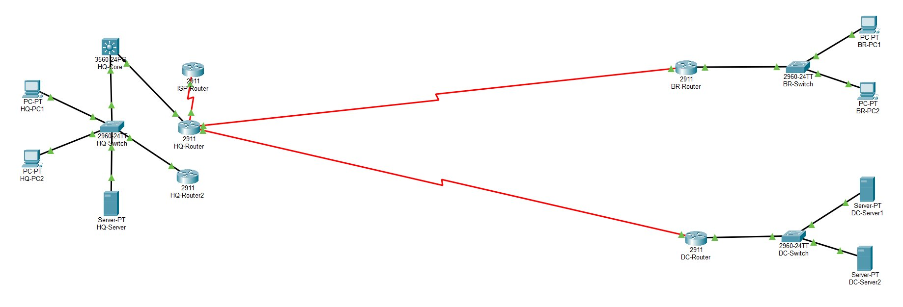
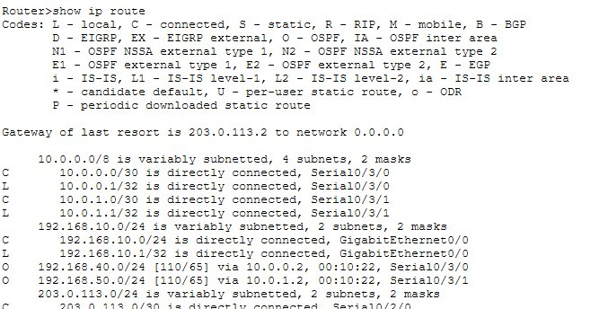
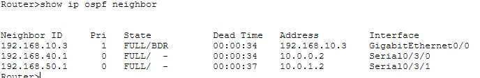
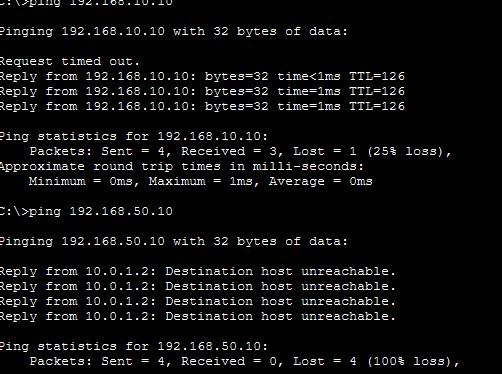
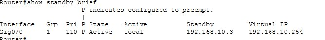
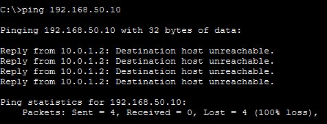
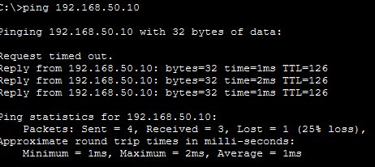
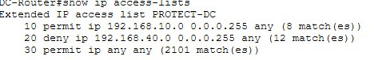
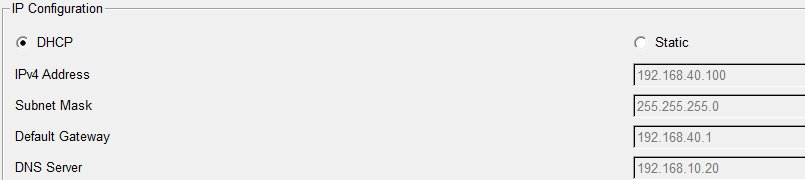
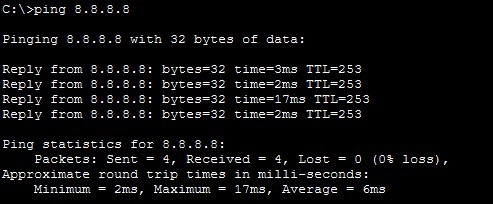

# 🏢 Enterprise Network Simulation Lab
### Multi-Site Infrastructure: OSPF · HSRP · ACLs · DHCP Relay · NAT


> Built a fully functional multi-site enterprise network simulation from scratch — implementing the core technologies used in real NOC and network engineering environments. Every protocol was configured, tested, and deliberately broken to validate recovery behavior.

---

## 📋 Table of Contents

- [Overview](#overview)
- [Network Architecture](#network-architecture)
- [IP Addressing Table](#ip-addressing-table)
- [Part 1 — OSPF Dynamic Routing](#part-1--ospf-dynamic-routing)
- [Part 2 — HSRP Gateway Redundancy](#part-2--hsrp-gateway-redundancy)
- [Part 3 — ACL Data Center Protection](#part-3--acl-data-center-protection)
- [Part 4 — DHCP Relay](#part-4--dhcp-relay)
- [Part 5 — NAT Internet Access](#part-5--nat-internet-access)
- [Troubleshooting Challenges](#troubleshooting-challenges)
- [Skills Demonstrated](#skills-demonstrated)

---

## Overview

This lab simulates the complete network infrastructure of a mid-sized enterprise with three physical locations — a Head Office, Branch Office, and Data Center — connected over WAN links and managed through enterprise-grade protocols.

**The goal:** Build, configure, test, and document a network that mirrors what NOC engineers and network technicians manage daily in production environments.

**Tools used:** Cisco Packet Tracer, Cisco 2911 Routers, Cisco 3560 Layer 3 Switch, Cisco 2960 Switches

---

## Network Architecture

```
                    ┌─────────────────────────────┐
                    │         ISP / INTERNET        │
                    │    Simulated: 8.8.8.8         │
                    └──────────────┬────────────────┘
                                   │ Serial WAN (203.0.113.0/30)
                    ┌──────────────┴────────────────┐
                    │         HEAD OFFICE            │
                    │   ISP-Router ── HQ-Router      │
                    │   HQ-Router2 (HSRP Standby)    │
                    │   HQ-Core (L3 Switch 3560)     │
                    │   HQ-Switch ── HQ-PC1/PC2      │
                    │   HQ-Server (DHCP + DNS)       │
                    │   Network: 192.168.10.0/24     │
                    └────────┬──────────────┬────────┘
                             │              │
              Serial WAN     │              │    Serial WAN
           (10.0.0.0/30)     │              │  (10.0.1.0/30)
                             │              │
          ┌──────────────────┴──┐      ┌────┴──────────────────┐
          │    BRANCH OFFICE    │      │     DATA CENTER        │
          │   BR-Router         │      │   DC-Router            │
          │   BR-Switch         │      │   DC-Switch            │
          │   BR-PC1 / BR-PC2   │      │   DC-Server1           │
          │   (DHCP from HQ)    │      │   DC-Server2           │
          │   192.168.40.0/24   │      │   192.168.50.0/24      │
          └─────────────────────┘      └────────────────────────┘
```

### Full Topology Screenshot



> Complete 3-site enterprise topology — HQ (left) with ISP-Router, HQ-Router, HQ-Router2 (HSRP), HQ-Core, HQ-Switch, and HQ-Server. Branch (top right) and Data Center (bottom right) connected via serial WAN links.

---

## IP Addressing Table

| Device | Interface | IP Address | Subnet Mask | Purpose |
|--------|-----------|------------|-------------|---------|
| HQ-Router | G0/0 | 192.168.10.1 | 255.255.255.0 | HQ Staff Gateway |
| HQ-Router | S0/3/0 | 10.0.0.1 | 255.255.255.252 | WAN to Branch |
| HQ-Router | S0/3/1 | 10.0.1.1 | 255.255.255.252 | WAN to DC |
| HQ-Router | S0/2/0 | 203.0.113.1 | 255.255.255.252 | WAN to ISP |
| HQ-Router2 | G0/0 | 192.168.10.3 | 255.255.255.0 | HSRP Standby |
| HSRP Virtual IP | — | 192.168.10.254 | 255.255.255.0 | HQ Gateway (shared) |
| BR-Router | G0/0 | 192.168.40.1 | 255.255.255.0 | Branch Gateway |
| BR-Router | S0/3/0 | 10.0.0.2 | 255.255.255.252 | WAN to HQ |
| DC-Router | G0/0 | 192.168.50.1 | 255.255.255.0 | DC Gateway |
| DC-Router | S0/3/0 | 10.0.1.2 | 255.255.255.252 | WAN to HQ |
| ISP-Router | S0/3/0 | 203.0.113.2 | 255.255.255.252 | Simulated ISP |
| ISP-Router | Loopback0 | 8.8.8.8 | 255.255.255.255 | Simulated Internet |
| HQ-PC1 | Fa0 | 192.168.10.10 | 255.255.255.0 | HQ Staff PC |
| HQ-PC2 | Fa0 | 192.168.10.11 | 255.255.255.0 | HQ Staff PC |
| HQ-Server | Fa0 | 192.168.10.20 | 255.255.255.0 | DHCP + DNS Server |
| BR-PC1 | Fa0 | 192.168.40.100 | 255.255.255.0 | DHCP assigned |
| BR-PC2 | Fa0 | 192.168.40.101 | 255.255.255.0 | DHCP assigned |
| DC-Server1 | Fa0 | 192.168.50.10 | 255.255.255.0 | Data Center Server |
| DC-Server2 | Fa0 | 192.168.50.11 | 255.255.255.0 | Data Center Server |

---

## Part 1 — OSPF Dynamic Routing

**Objective:** Connect all three sites using OSPF Area 0 so routes are learned and shared automatically — eliminating the need for static routes and enabling automatic failover if a link goes down.

### Configuration

All three routers run OSPF Process 1, Area 0:

```
! HQ-Router
router ospf 1
 network 192.168.10.0 0.0.0.255 area 0
 network 10.0.0.0 0.0.0.3 area 0
 network 10.0.1.0 0.0.0.3 area 0
 default-information originate

! BR-Router
router ospf 1
 network 192.168.40.0 0.0.0.255 area 0
 network 10.0.0.0 0.0.0.3 area 0

! DC-Router
router ospf 1
 network 192.168.50.0 0.0.0.255 area 0
 network 10.0.1.0 0.0.0.3 area 0
```

### Verification

**OSPF Routing Table — HQ-Router**



> `show ip route` on HQ-Router showing O (OSPF) entries for Branch (192.168.40.0/24) and Data Center (192.168.50.0/24). Gateway of last resort set to ISP via default route redistribution.

**OSPF Neighbor Table**



> Three OSPF neighbors in FULL state: HQ-Router2 (GigabitEthernet), BR-Router (Serial0/3/0), and DC-Router (Serial0/3/1). All adjacencies stable.

**Cross-Site Ping Test**



> BR-PC1 pinging HQ-PC1 (192.168.10.10) — 3/4 packets (first drop is normal ARP). BR-PC1 attempting DC-Server — blocked by ACL (expected — see Part 3).

### Key Commands
```
show ip route              → verify OSPF learned routes
show ip ospf neighbor      → verify neighbor adjacencies
show ip ospf interface     → verify OSPF on each interface
debug ip ospf events       → real-time OSPF troubleshooting
```

---

## Part 2 — HSRP Gateway Redundancy

**Objective:** Eliminate single point of failure at HQ by deploying two routers sharing a virtual gateway IP. Users point to the virtual IP — if the active router fails, the standby takes over automatically within seconds.

### Design

```
HQ-Router   → Active  (Priority 110, preempt enabled)
HQ-Router2  → Standby (Priority 90)
Virtual IP  → 192.168.10.254 (all HQ PCs use this as gateway)
```

### Configuration

```
! HQ-Router (Active)
interface gigabitethernet 0/0
 standby 1 ip 192.168.10.254
 standby 1 priority 110
 standby 1 preempt

! HQ-Router2 (Standby)
interface gigabitethernet 0/0
 standby 1 ip 192.168.10.254
 standby 1 priority 90
 standby 1 preempt
```

### Verification



> `show standby brief` on HQ-Router — State: Active, Priority: 110 (P = preempt configured), Standby: 192.168.10.3 (HQ-Router2), Virtual IP: 192.168.10.254.

### Failover Test Results
```
Test: Shut down HQ-Router G0/0 (simulate failure)
Result: 50% packet loss during 3-second switchover
        HQ-Router2 assumed Active role automatically
        Traffic recovered without manual intervention

Test: Restore HQ-Router G0/0
Result: HQ-Router preempted back to Active
        HQ-Router2 returned to Standby
        Zero intervention required
```

### Key Commands
```
show standby brief         → verify active/standby state
show standby detail        → full HSRP configuration
debug standby events       → real-time HSRP troubleshooting
```

---

## Part 3 — ACL Data Center Protection

**Objective:** Restrict Data Center access using a named extended ACL — only the HQ network is permitted, Branch is explicitly denied. Applied inbound on the WAN-facing interface of DC-Router.

### Security Policy
```
PERMIT: 192.168.10.0/24 (HQ Staff) → DC Servers
DENY:   192.168.40.0/24 (Branch)   → DC Servers
PERMIT: All other traffic           → pass through
```

### Configuration

```
! DC-Router
ip access-list extended PROTECT-DC
 permit ip 192.168.10.0 0.0.0.255 any
 deny ip 192.168.40.0 0.0.0.255 any
 permit ip any any

interface serial 0/3/0
 ip access-group PROTECT-DC in
```

### Verification

**Branch BLOCKED from Data Center**



> BR-PC1 pinging DC-Server1 (192.168.50.10) — 100% loss. Reply from 10.0.1.2 (DC-Router WAN interface) saying destination unreachable — ACL deny rule triggered.

**HQ PERMITTED to Data Center**



> HQ-PC1 pinging DC-Server1 (192.168.50.10) — 3/4 packets (first drop ARP). HQ traffic flows freely to Data Center as designed.

**ACL Match Counters**



> `show ip access-lists` on DC-Router — Rule 10 (permit HQ): 8 matches. Rule 20 (deny Branch): 12 matches. Rule 30 (permit any): 2101 matches. Live hit counters confirm ACL is actively filtering traffic.

### Key Commands
```
show ip access-lists           → verify ACL rules and hit counts
show ip interface serial 0/3/0 → verify ACL applied to interface
```

---

## Part 4 — DHCP Relay

**Objective:** Allow Branch PCs to receive IP addresses automatically from the central DHCP server at HQ, using ip helper-address to forward broadcasts across the WAN link.

### Design
```
Problem:  DHCP broadcasts don't cross routers
Solution: BR-Router intercepts broadcast,
          forwards as unicast to HQ-Server (192.168.10.20)
          HQ-Server responds with IP from BranchPool scope
```

### Configuration

```
! HQ-Server DHCP Scope (BranchPool)
Pool Name:       BranchPool
Network:         192.168.40.0/24
Start IP:        192.168.40.100
Default Gateway: 192.168.40.1
DNS Server:      192.168.10.20
Max Users:       50

! BR-Router
interface gigabitethernet 0/0
 ip helper-address 192.168.10.20
```

### Verification



> BR-PC1 IP Configuration set to DHCP — received 192.168.40.100 automatically from HQ-Server. Gateway 192.168.40.1 and DNS 192.168.10.20 correctly pushed via scope options. Zero manual configuration at Branch.

### Key Commands
```
show running-config interface g0/0  → verify helper-address
show ip dhcp binding                → view all active leases (on server)
show ip dhcp pool                   → verify scope configuration
ipconfig /release + /renew          → force DHCP renewal on client
```

---

## Part 5 — NAT Internet Access

**Objective:** Enable all three sites to reach the internet through HQ-Router using PAT (Port Address Translation) — translating multiple private IPs to one public IP.

### Design
```
Inside networks:  192.168.10.x, 192.168.40.x, 192.168.50.x
Outside (public): 203.0.113.1 (HQ-Router Serial0/2/0)
Translation type: PAT (overload) — many devices, one public IP
Default route:    redistributed via OSPF to Branch and DC
```

### Configuration

```
! HQ-Router
access-list 1 permit 192.168.10.0 0.0.0.255
access-list 1 permit 192.168.40.0 0.0.0.255
access-list 1 permit 192.168.50.0 0.0.0.255

ip nat inside source list 1 interface serial 0/2/0 overload

interface gigabitethernet 0/0
 ip nat inside
interface serial 0/3/0
 ip nat inside
interface serial 0/3/1
 ip nat inside
interface serial 0/2/0
 ip nat outside

ip route 0.0.0.0 0.0.0.0 203.0.113.2

router ospf 1
 default-information originate
```

### Verification



> BR-PC1 pinging 8.8.8.8 (simulated internet via ISP-Router loopback) — 4/4 packets, 0% loss. Traffic traverses: BR-PC1 → BR-Router → HQ-Router (NAT translation) → ISP-Router → 8.8.8.8.

### Test Results
```
HQ-PC1    → ping 8.8.8.8   ✅ 0% loss
BR-PC1    → ping 8.8.8.8   ✅ 0% loss
DC-Server1 → ping 8.8.8.8  ✅ 0% loss
```

### Key Commands
```
show ip nat translations    → view active NAT table
show ip nat statistics      → view translation counters
debug ip nat                → real-time NAT troubleshooting
```

---

## Troubleshooting Challenges

Real issues encountered and resolved during the build — not a clean run from a tutorial.

| Issue | Symptom | Root Cause | Resolution |
|-------|---------|------------|------------|
| OSPF route missing | BR-PC1 couldn't reach HQ Server | HQ-Router G0/1 was down/down — nothing connected | Moved HQ-Server to 192.168.10.x, shut down unused G0/1 |
| ACL not blocking Branch | BR-PC1 still reached DC after ACL applied | ACL applied to G0/0 but Branch traffic enters via S0/3/0 | Moved ACL to `interface serial 0/3/0 ip access-group PROTECT-DC in` |
| NAT not translating Branch | BR-PC1 couldn't reach 8.8.8.8 | Serial0/3/0 not marked as `ip nat inside` | Added `ip nat inside` to all internal-facing interfaces |
| ISP link down/down | HQ-Router couldn't reach ISP | GigabitEthernet auto-negotiation failure in PT | Replaced with Serial DCE cable — stable up/up |
| DHCP relay not working | BR-PC1 couldn't get IP via DHCP | ip helper-address configured but DHCP scope missing | Created BranchPool scope on HQ-Server with correct network |
| Default route not propagating | Branch couldn't reach internet despite NAT working | `default-information originate` missing from OSPF config | Added to HQ-Router OSPF process — Branch learned O*E2 route |

---

## Skills Demonstrated

```
Routing                 Security               High Availability
───────────────         ──────────────         ─────────────────
✅ OSPF Area 0          ✅ Extended ACLs        ✅ HSRP Active/Standby
✅ Multi-site routing   ✅ Named ACLs           ✅ Virtual IP failover
✅ Default route        ✅ Inbound filtering    ✅ Preempt configuration
✅ Route redistribution ✅ Traffic verification ✅ Failover testing

Addressing              Services               Documentation
───────────────         ──────────────         ─────────────────
✅ Subnetting /24 /30   ✅ DHCP Relay           ✅ Network diagrams
✅ WAN point-to-point   ✅ ip helper-address    ✅ IP addressing tables
✅ Private/public IP    ✅ NAT PAT overload      ✅ Config snippets
✅ VLSM design          ✅ Multi-site DHCP      ✅ Troubleshooting log
```

---

## Interview Story

> *"I built a multi-site enterprise network simulation with a Head Office, Branch Office, and Data Center. I configured OSPF Area 0 routing between all three sites — verified with show ip route showing O entries for all remote networks. I implemented HSRP for gateway redundancy at HQ with a virtual IP of 192.168.10.254, priority 110 on the active router with preempt — tested failover by shutting down the active interface and confirmed traffic recovered automatically. I wrote a named extended ACL called PROTECT-DC that blocks Branch traffic from the Data Center while permitting HQ, applied inbound on the WAN interface — verified with live hit counters. I configured DHCP relay using ip helper-address so Branch PCs automatically get IPs from the central HQ server across the WAN. Finally I set up NAT PAT on HQ-Router so all three sites reach the internet through one public IP, with the default route redistributed via OSPF. Everything is documented on GitHub with topology diagrams, IP tables, config snippets, and a troubleshooting log."*

---

*Part of a self-directed home lab series building toward NOC Analyst and Network Engineer roles.*

🔗 **Related:** [Home Lab Project 1 — Active Directory & Windows Server Infrastructure](https://github.com/abdussameea1813/home-lab-network)
